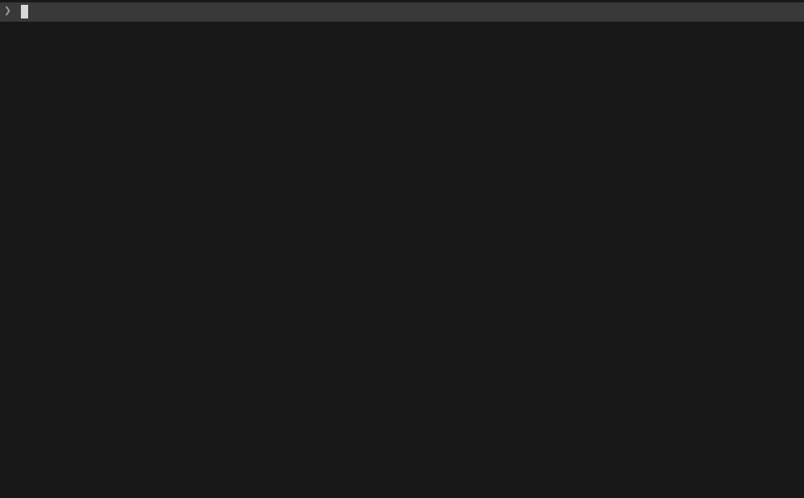

# agentic-workflow

[](LICENSE)
[](#skills)
[](CHANGELOG.md)
[](#)

**Coding agents are fast at writing code and reckless about everything around it.** Unharnessed agents create their own scope, skimp on code reviews, forgo testing and verification, ignore cost, and don't know when to stop and ask you. This plugin serves as the agentic development operating manual: thirteen skills that keep the user firmly in charge while agents do the work, from day-one project setup through product discovery, phased delivery, independent review, enforceable quality gates, and improving the workflow itself.

## Model

The plugin's default state assumes a solo maintainer who ratifies every product, architecture, and merge decision. Every checkpoint (spec approval, review acceptance, gate changes, release tagging, etc.) requires explicit human approval, unless the maintainer specifies otherwise. The plugin's skills can also be adapted to multi-dev environments; team-based review, multi-maintainer governance, and organizational compliance workflows aren't inherently modeled, but the plugin is designed to adapt and evolve to better suit the maintainers working environment through repeated use.

No matter the user's background, agents always operate under human authority: they propose, draft, and verify, but never ship without the maintainer's sign-off.

## Installation

**Claude Code** — add the marketplace, then install:

```
/plugin marketplace add gidde032/agentic-workflow
/plugin install agentic-workflow@gidde032-plugins
```

**Codex** — add the marketplace, then install:

```
codex plugin marketplace add gidde032/agentic-workflow
codex plugin add agentic-workflow@gidde032-plugins
```

## Getting started

Start with **`agentic-project-bootstrap`**, the entry point for the entire system. It instantiates the project structure, establishes governance, and routes to sibling skills as needed. For an existing repository, bootstrap inventories what you have and offers the appropriate skills (including `agentic-docs-github-migration` for repositories with documentation but no GitHub governance).

### Your first 20 minutes

Once installed, invoke bootstrap and let it drive:

```
$agentic-project-bootstrap set up the workflow for this project
```

Here's what a fresh-project run looks like end to end:

1. **Ratify the profile** — bootstrap runs a short, bounded interview (goal, stack, maintainer model, repository identity, visibility, license, quality bar, cost sensitivity, action authority) and stops for your sign-off. Nothing is written until you approve.
2. **Write and approve the spec** — vision, testable functional requirements, numeric budgets, phase outline where *each phase ends in a usable increment*, risks, deferred scope, definition of done. You review; it doesn't create GitHub artifacts from an unratified spec.
3. **Stand up governance** — day-one memory files, a label vocabulary, the first milestone, first-horizon Issues, 3–6 measured quality gates wired into local hooks and CI, and the review cadence (default: 3 reviewers with a standing skeptic).
4. **Ship the first slice** — pick the first `ready` Issue, branch, implement against a work packet, and open a **draft PR after the first green commit**. Independent review happens before the PR is marked ready; you approve the merge.

From there the per-phase loop (`agentic-phase-workflow`) takes over, and the cross-cutting skills (memory, cost, review, verification, evolution) are available throughout. An entire phase can be implemented through subagent review and repair, but consequential steps like spec approval, review acceptance, gate changes, merges, and releases stop for you.

> **Want proof it works?** This repository itself was run through the loop; browse its [Issues](https://github.com/gidde032/agentic-workflow/issues), milestones, and pull requests to see the same workflow in practice.



For the authority model behind every checkpoint, see `agentic-collaboration-cadence`.

## Architecture

```
                 ┌─────────────────────┐
                 │  project-bootstrap  │
                 └──────────┬──────────┘
        ┌──────────┬────────┼──────────┬──────────────┐
        ▼          ▼        ▼          ▼              ▼
    product-    phase-   review-  verification-  docs-github-
    discovery   workflow  orch     discipline     migration
        │          │        │          │
        ▼          ▼        ▼          ▼
     ┌────────────────────────────────────┐
     │  session-econ · collaboration ·    │
     │  weaker-models · implement-orch ·  │
     │  workflow-evolution · project-mem  │
     └────────────────────────────────────┘
            cross-cutting skills
```

`project-bootstrap` is the entry point. It routes to lifecycle skills (top row) based on what the project needs. Cross-cutting skills (bottom) are available throughout.

## Skills

| Skill | Purpose |
|---|---|
| `agentic-project-bootstrap` | Day-one instantiation runbook for the whole workflow system |
| `agentic-product-discovery` | Turn an uncertain idea into a ratified product-and-design contract before implementation |
| `agentic-phase-workflow` | Run the issue-backed development loop from spec to shipped increments |
| `agentic-implementation-orchestration` | Orchestrate approved Issue-backed implementation with parent/implementer agents |
| `agentic-review-orchestration` | Run independent, contextless multi-agent review against a draft-PR diff |
| `agentic-verification-discipline` | Build trustworthy verification evidence and make gates enforceable locally and in CI |
| `agentic-project-memory` | Assign each kind of information to one authoritative location across sessions |
| `agentic-collaboration-cadence` | Establish the human-in-the-loop authority model for agentic project work |
| `agentic-session-economics` | Keep agent-session spend proportional to work delivered |
| `agentic-driving-weaker-models` | Get strong-model-quality results from cheaper/smaller agent sessions |
| `agentic-docs-github-migration` | Migrate an existing repository's docs and governance to GitHub (explicit invocation only) |
| `agentic-workflow-evolution` | Improve the workflow itself through evidence rather than theory |
| `agentic-decision-challenge` | Stress-test one proposed decision until its hidden assumptions and dependent choices are visible — invoke with `/grill` |

## Prerequisites

Most skills require only Claude Code (or a Codex-compatible agent). Three skills have additional dependencies:

- **`agentic-docs-github-migration`** — Python 3.10+, PyYAML, and the repository's profile/ledger validators (`scripts/validate_profile.py`, `scripts/validate_disposition.py`, `scripts/verify_fingerprints.py`)
- **`agentic-verification-discipline`** and **`agentic-review-orchestration`** — GitHub CLI (`gh`) for creating required checks, rulesets, and PR operations

## Project structure

```
commands/
  grill.md              # /grill — deterministic front door for agentic-decision-challenge
skills/
  agentic-*/
    SKILL.md              # Skill definition (frontmatter + body)
    examples.md           # Worked examples and provenance
    agents/openai.yaml    # Codex/OpenAI interface metadata
    references/           # Extracted reference tables (some skills)
    assets/               # Templates and fixtures (some skills)
    scripts/              # Validators (migration skill only)
evals/
  harness/              # Patched eval runner (serial, sandboxed, model-pinned)
  agentic-*/eval-set.json  # Per-skill routing eval sets (15 cases each)
  run_e1.sh             # Execution eval: verifies agents read extracted references
```

The `evals/` directory contains routing and execution eval tooling. Routing evals test whether skill descriptions trigger correctly for a set of queries. Execution evals test whether agents follow pointers to extracted reference files. Run via `evals/harness/run.sh <skill-name>`.

## Contributing

Issues and pull requests are welcome, see [CONTRIBUTING.md](CONTRIBUTING.md). The plugin's own `agentic-workflow-evolution` skill describes how workflow changes should be proposed and validated, emphasizing alterations through repeated evidence, not theory. This repository runs that loop on itself: changes go through an Issue, a draft PR, and review before merge.

## License

[MIT](LICENSE)
